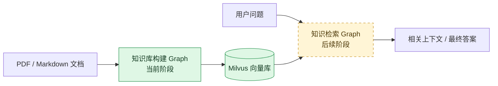
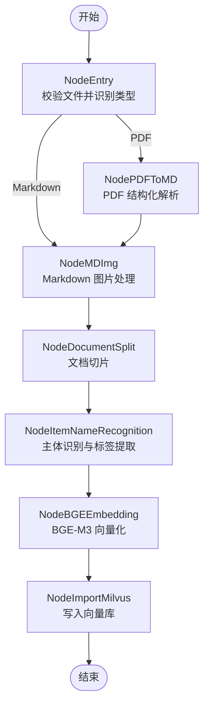
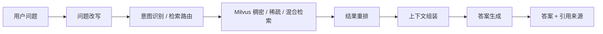

# RAGProject

一个基于 **LangGraph** 编排的 RAG（Retrieval-Augmented Generation，检索增强生成）项目。

当前阶段聚焦于搭建 **RAG 知识库构建流程**：将 PDF 或 Markdown 文档依次完成解析、图片理解、文本切分、主体识别、向量化，并写入 Milvus。后续将在同一套 Graph 架构下增加 **知识检索流程**，最终形成“知识入库 Graph + 知识检索 Graph”两条相互独立、共享数据规范的工作流。

> 当前项目处于架构搭建阶段。文档路由节点已经实现，其余业务节点已建立统一接口和执行顺序，具体处理逻辑仍需逐步补充。

## 项目目标

- 使用 Graph 描述 RAG 流程，使节点职责、执行顺序和状态流转清晰可见。
- 支持 PDF、Markdown 等不同来源的知识文档接入。
- 将文档解析、切片、标签提取、向量化和持久化拆分为可独立测试的节点。
- 为后续混合检索、重排、上下文组装和答案生成预留扩展空间。
- 通过统一的 State 在节点之间传递数据，减少模块之间的直接依赖。

## 总体架构

项目计划由两个 Graph 组成：



- **知识库构建 Graph（当前）**：负责把原始文档转换为可检索的向量数据。
- **知识检索 Graph（规划）**：负责理解问题、检索知识、重排结果、组装上下文，并按需要生成答案。

两条 Graph 通过 Milvus 中的数据结构衔接，但各自维护独立的状态类型和节点，便于分别开发、测试和扩展。

## 当前知识库构建流程

入口节点根据文件后缀选择处理分支：PDF 先转换为 Markdown，Markdown 则直接进入后续流程。



### 节点状态

| 节点 | 职责 | 当前状态 |
| --- | --- | --- |
| `NodeEntry` | 校验文件路径，识别 PDF/Markdown，并初始化分支状态 | 已实现 |
| `NodePDFToMD` | 将 PDF 解析为结构化 Markdown | 待实现 |
| `NodeMDImg` | 提取并理解 Markdown 中的图片或多模态内容 | 待实现 |
| `NodeDocumentSplit` | 根据标题、段落或语义边界切分文档 | 待实现 |
| `NodeItemNameRecognition` | 识别文档主体并提取标签 | 待实现 |
| `NodeBGEEmbedding` | 使用 BGE-M3 将切片转换为向量 | 待实现 |
| `NodeImportMilvus` | 将文本、元数据和向量持久化到 Milvus | 待实现 |

待实现节点目前会原样返回 State，可用于验证 Graph 的连接关系，但尚不会生成真实的解析、向量或入库结果。

## 项目结构

```text
RAGProject/
├── main_graph.py                         # 知识库构建 Graph 的装配与运行入口
├── pyproject.toml                        # Python 版本与项目依赖
├── uv.lock                               # uv 依赖锁定文件
├── .env.example                          # 环境变量示例
└── tiiauo/
    ├── import_process/
    │   ├── base.py                       # Graph 节点抽象基类
    │   ├── state.py                      # 入库流程的共享状态定义
    │   └── nodes/
    │       ├── node_entry.py             # 输入校验与格式路由
    │       ├── node_pdf_to_md.py         # PDF 转 Markdown
    │       ├── node_md_img.py            # Markdown 图片处理
    │       ├── node_document_split.py    # 文档切片
    │       ├── node_item_name_recognition.py
    │       ├── node_bge_embedding.py     # 文本向量化
    │       └── node_import_milvus.py     # Milvus 入库
    └── tool/
        └── logger.py                     # 彩色日志配置
```

## State 数据流

`ImportGraphState` 是入库 Graph 中所有节点共享的数据契约。节点只负责读取自身需要的字段，并返回本节点新增或更新的字段。

| 数据类别 | 字段 | 用途 |
| --- | --- | --- |
| 任务信息 | `task_id` | 标识一次入库任务，便于日志追踪和幂等处理 |
| 流程控制 | `is_md_read_enabled`、`is_pdf_read_enabled` | 控制入口后的条件分支 |
| 文件路径 | `local_file_path`、`local_dir`、`pdf_path`、`md_path` | 保存原始文件和中间产物位置 |
| 文档信息 | `file_title`、`md_content` | 保存标题和 Markdown 全文 |
| 处理结果 | `chunks`、`item_name` | 保存切片、主体和标签信息 |
| 向量数据 | `embeddings_content` | 保存准备写入 Milvus 的向量及关联内容 |

随着节点逐步实现，建议把 State 中非入口必需的字段声明为可选字段，或为不同阶段定义更明确的数据模型，避免节点在中间字段尚未产生时误用数据。

## 环境要求

- Python `>= 3.13`
- 推荐使用 [uv](https://docs.astral.sh/uv/) 管理依赖
- 后续完整运行入库流程时，需要可访问的文档解析服务、Embedding 模型和 Milvus 实例

## 安装

```bash
uv sync
```

如果不使用 uv，也可以根据 `pyproject.toml` 使用其他 Python 包管理工具创建环境并安装依赖。

## 运行当前 Graph

在项目根目录执行：

```bash
uv run python main_graph.py
```

运行前需要将 `main_graph.py` 示例中的 `local_file_path` 修改为本机真实存在的 `.pdf` 或 `.md` 文件路径。

也可以在代码中直接调用：

```python
from main_graph import ImportMainGraphRunner

initial_state = {
    "local_file_path": r"D:\\documents\\example.md",
}

result = ImportMainGraphRunner.create_and_run(initial_state)
print(result)
```

目前只有输入检查和格式路由具有实际处理逻辑，因此此命令主要用于验证 Graph 是否能够正确执行。`.env.example` 暂未定义配置项；接入模型、Milvus 或其他外部服务时，应在其中补充变量名，并将真实密钥写入本地 `.env`。

## 开发新的入库节点

所有入库节点继承 `NodeBase`，统一获得开始、完成和异常日志。新增节点需要设置唯一的 `name`，并实现 `process` 方法：

```python
from tiiauo.import_process.base import NodeBase
from tiiauo.import_process.state import ImportGraphState


class NodeExample(NodeBase):
    name = "node_example"

    def process(self, state: ImportGraphState) -> ImportGraphState:
        # 读取上游字段并完成本节点处理
        return {
            **state,
            # "new_field": result,
        }
```

完成节点后，需要在 `ImportMainGraphRunner.add_nodes()` 中注册节点，并在 `add_edges()` 中声明它与上下游节点的连接关系。

开发时建议遵循以下约定：

- 一个节点只承担一个清晰职责，避免把解析、切片、向量化写在同一节点中。
- 节点输入输出保持可序列化，方便记录状态、失败重试和任务恢复。
- 外部服务客户端通过配置或依赖注入创建，不在节点中硬编码地址和密钥。
- 写入 Milvus 时使用稳定的文档 ID 和切片 ID，保证重复执行同一任务不会产生重复数据。
- 每个节点单独编写测试，再增加覆盖完整 Graph 路由和状态流转的集成测试。

## Milvus 数据建议

后续实现 `NodeImportMilvus` 时，每个切片建议至少保存以下信息：

| 字段 | 说明 |
| --- | --- |
| `chunk_id` | 切片唯一标识，可由文档 ID、切片序号和内容哈希生成 |
| `document_id` | 原始文档唯一标识 |
| `content` | 切片原文 |
| `dense_vector` | BGE-M3 生成的稠密向量 |
| `sparse_vector` | 可选的稀疏向量，用于混合检索 |
| `file_title` | 原始文件标题 |
| `item_name` | 文档主体或业务对象名称 |
| `source_path` | 原始文档位置 |
| `chunk_index` | 切片在文档中的顺序 |
| `metadata` | 页码、标题层级、标签等扩展信息 |

Milvus Collection 的向量维度、距离度量和索引类型必须与实际使用的 Embedding 模型保持一致。

## 后续检索 Graph 规划

建议后续新增独立的 `retrieval_process` 模块，不与入库 State 或节点混用：

```text
tiiauo/retrieval_process/
├── base.py
├── state.py
└── nodes/
    ├── node_query_rewrite.py
    ├── node_intent_recognition.py
    ├── node_milvus_retrieval.py
    ├── node_rerank.py
    ├── node_context_builder.py
    └── node_answer_generation.py
```

建议的检索流程如下：



检索 Graph 的 State 可包含 `query`、`rewritten_query`、`intent`、`retrieved_chunks`、`reranked_chunks`、`context`、`answer` 和 `sources` 等字段。这样既能复用当前 Graph 的节点设计方式，也能避免入库数据与查询数据互相污染。

## Roadmap

- [x] 建立统一的 Graph 节点基类与日志机制
- [x] 定义知识库构建 State
- [x] 完成 PDF/Markdown 输入识别与条件路由
- [x] 串联完整的知识库构建 Graph 骨架
- [ ] 实现 PDF 结构化解析
- [ ] 实现 Markdown 图片提取与多模态理解
- [ ] 实现文档切片策略
- [ ] 实现主体识别和标签提取
- [ ] 接入 BGE-M3 Embedding
- [ ] 设计并创建 Milvus Collection
- [ ] 实现向量数据的幂等写入
- [ ] 增加节点单元测试与 Graph 集成测试
- [ ] 新增知识检索 Graph
- [ ] 增加混合检索、重排、引用和答案生成
- [ ] 通过 FastAPI 对外提供入库与检索接口

## 技术栈

- **LangGraph**：工作流和状态编排
- **LangChain**：模型、文本处理和 RAG 组件集成
- **BGE-M3（规划接入）**：稠密/稀疏文本向量化
- **Milvus（规划接入）**：向量数据存储与检索
- **FastAPI（规划使用）**：入库及检索服务接口
- **uv**：Python 依赖与虚拟环境管理

## 注意事项

- 不要提交 `.env`、密钥、模型访问令牌或数据库密码。
- 当前代码中的示例路径仅用于本地调试，提交前建议改为命令行参数或配置项。
- PDF 转换和图片理解可能产生临时文件，建议统一写入已忽略的 `output/` 或 `tmp/` 目录。
- 文档更新或删除时，需要同步更新 Milvus 中对应的切片，避免召回过期知识。
- 对外返回检索结果时建议携带来源文件、页码或标题路径，保证答案可追溯。
